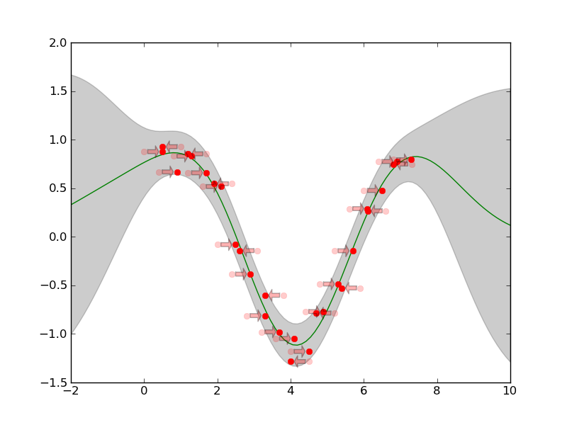

Application Example of GP regression
====================================

This Example shows the Squared Exponential CF
(:py:class:`pygp.covar.se.SEARDCF`) preprocessed by
shiftCF(:py:class`covar.combinators.ShiftCF) and combined with noise
:py:class:`pygp.covar.noise.NoiseISOCF` by summing them up
(using :py:class:`pygp.covar.combinators.SumCF`).
We will shift two input replicates against each other, to make them fit to each other.

First of all we have to import all important packages::

    import pylab as PL
    import scipy as SP
    import numpy.random as random

Now import the Covariance Functions and Combinators::

    from pygp.covar import se, noise, combinators

And additionally the GP regression framework (:py:class:`pygp.gp`, :py:class:`pygp.priors` for the priors and :py:class:`pygp.plot.gpr_plot` for plotting the results)::

    from pygp.gp.basic_gp import GP
    from pygp.optimize.optimize import opt_hyper
    from pygp.priors import lnpriors
    import pygp.plot.gpr_plot as gpr_plot

For this particular example we generate some simulated random sinus
data; just samples from a superposition of a `sin + linear` trend::

    xmin = 1
    xmax = 2.5*SP.pi
    x1 = SP.arange(xmin,xmax,.7)
    x2 = SP.arange(xmin,xmax,.4)

    C = 2       #offset
    b = 0.5
    sigma = 0.1

    b = 0

    y1  = b*x1 + C + 1*SP.sin(x1)
    dy1 = b   +     1*SP.cos(x1)
    y1 += sigma*random.randn(y1.shape[0])
    y1-= y1.mean()

    y2  = b*x2 + C + 1*SP.sin(x2)
    dy2 = b   +     1*SP.cos(x2)
    y2 += sigma*random.randn(y2.shape[0])
    y2-= y2.mean()

    x1 = x1[:,SP.newaxis]
    x2 = (x2-1)[:,SP.newaxis]

    x = SP.concatenate((x1,x2),axis=0)
    y = SP.concatenate((y1,y2),axis=0)

The predictions we will make on the interpolation interval ::

   X = SP.linspace(-2,10,100)[:,SP.newaxis]

For the calculation of the replicates, we need to give the replicate indices per input x::

    dim = 1
    replicate_indices = SP.concatenate([SP.repeat(i,len(xi)) for i,xi in enumerate((x1,x2))])
    n_replicates = len(SP.unique(replicate_indices))

Thus, our starting hyperparameters are::

    logthetaCOVAR = SP.log([1,1,1,1,sigma])
    hyperparams = {'covar':logthetaCOVAR}

Now the interesting point: creating the sumCF by combining noise and se::

    SECF = se.SEARDCF(dim)
    noiseCF = noise.NoiseISOCF()
    shiftCF = combinators.ShiftCF(SECF,replicate_indices)
    covar = combinators.SumCF((shiftCF,noiseCF))

And the prior believes, we have about the hyperparameters::

    covar_priors = []
    #Length-Scale
    covar_priors.append([lnpriors.lngammapdf,[1,2]])
    for i in range(dim):
        covar_priors.append([lnpriors.lngammapdf,[1,1]])

    #X-Shift
    for i in range(n_replicates):
        covar_priors.append([lnpriors.lngausspdf,[0,.5]])    

    #Noise
    covar_priors.append([lnpriors.lngammapdf,[1,1]])
    priors = {'covar':covar_priors}

We want all hyperparameters to be optimized::

    Ifilter = {'covar': SP.array([1,1,1,1,1],dtype='int')}

.. To ensure the gpr optimization of the shifts can be positive and
   negative, we say the optimizer to only exponentiate Amplitude, 
   Length-Scale and noise::
   Iexp = {'covar': SP.array([1,1,0,0,1],dtype='bool')}

Create the GP regression class for further usage::

    gpr = GP(covar,x=x,y=y)

And optimize the hyperparameters::

   [opt_model_params,opt_lml]=opt_hyper(gpr,hyperparams,priors=priors,gradcheck=False,Ifilter=Ifilter)

With these optimized hyperparameters we can now predict the point-wise mean M and deviance S of the training data::

    [M,S] = gpr.predict(opt_model_params,X)

For the sake of beauty plot the mean M and deviance S::

    T = opt_model_params['covar'][2:4]
    gpr_plot.plot_sausage(X,M,SP.sqrt(S))
    gpr_plot.plot_training_data(x,y,shift=T,replicate_indices=replicate_indices)

The resulting plot is:

